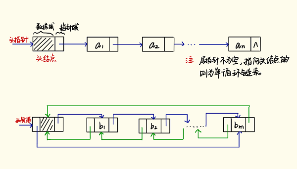

# 链表

## 概述
链表是线性表的链式存储结构。用一组任意的存储单元存储线性表的数据元素，存储单元可以不连续。所以链式结构中除了存储数据元素信息外，还要存储它的后继元素的存储地址，双链表的话还要存储前驱元素的存储地址。

线性表就是零个或多个类型相同的数据元素的有限序列，每个元素只有最多一个前驱元素，最多一个后继元素。

链表和数组类似，只不过数组是顺序存储结构，需要一段连续的地址空间来存储数据，且变化过程中需要移动大量元素；长度变化时难以确定存储空间；造成存储空间碎片化。链表就是为了克服线性表顺序存储结构的这些缺点而设计的，虽然也会存在存取元素的时间复杂度提升，但是优点大于缺点。

链表主要的类型有两种：单链表（上图）和双链表（下图）。每一个结点就是一个长方块，不仅包含值还包含了链接到下一个结点或者上一个结点的地址。



## A-单链表

单链表结点的典型定义为：

```cpp
struct SinglListNode{
  int val;
  SingleListNode* next;
  SingleListNode(int x) : val(x), next(NULL) {}
};
```
